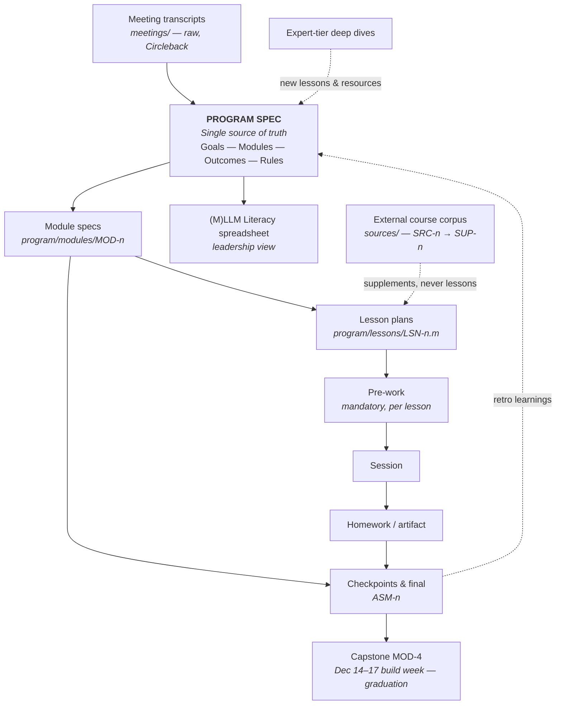
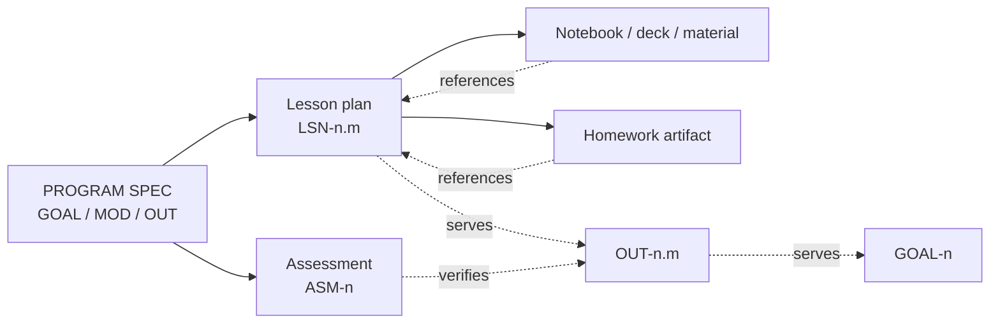

# Program Spec — VSP AI/ML Training Program

## Overview

The governing spec for the VSP AI/ML training program. The **Program Spec is the single source of truth**: every module plan, lesson plan, assessment, notebook, and status spreadsheet is generated from it and references it by ID. Nothing downstream redefines the curriculum — it traces back here.

This mirrors the `ai-way` model (`sdlc.md` / App Spec): the spec is the center; everything else is a view.

> **The (M)LLM Literacy spreadsheet is a view, not the source.** It is the leadership-facing artifact generated *from* this spec for Vlad to present to Marius Banici. When the spec changes, the spreadsheet is regenerated — never the other way around.
>
> **One exception, recorded (2026-08-03):** the spreadsheet carried the *scheduling decision* — dates, 1 h live per lesson, homework budgets (2 h; 4 h for MOD-2), roles, and a Phase-4 capstone — and the spec was updated to match. That was a leadership scheduling call flowing back in through the normal review loop, not the spreadsheet redefining curriculum content. The calendar now lives in [`SCHEDULE.md`](SCHEDULE.md).

---

## The Flow

Feedback loops are first-class: module retros and expert-tier discoveries flow back into the spec ("this shit here feeds" — Vlad), and the spec regenerates its views.

External material enters through one door only. A donated course corpus is catalogued as `SRC-n` and processed into `SUP-n` supplements in [`sources/`](sources/README.md) — build-ready checklists, drills, and rubrics attached to existing `LSN-n.m` by ID. A supplement enriches a lesson or shortens a `GAP-n` build; it never becomes a lesson, never re-times a session, and never grows a homework budget. Anything the corpus contains that no outcome claims is either an advanced/expert-tier candidate or it is dropped.

---

## Traceability — Everything Links Back

> The spec does not know about the lessons. Lessons reference outcomes, outcomes reference goals, assessments verify outcomes. Coverage is checked by querying: "which lesson serves OUT-2.4?" and "which assessment verifies it?" An outcome with no serving lesson or no verifying assessment is a curriculum gap — investigate.

### ID Registry

| Prefix | Meaning | Defined in | Referenced by |
|---|---|---|---|
| `GOAL-n` | Program goal | this file | module outcomes |
| `MOD-n` | Module (basics tier: 0–3; capstone: 4) | `modules/module-n-*.md` | lessons, assessments, spreadsheet |
| `OUT-n.m` | Module outcome ("can-do" statement) | module spec | lessons (serves), assessments (verifies) |
| `LSN-n.m` | Lesson | module spec (inventory) → `lessons/LSN-n.m-*.md` (full plan) | notebooks, homework, spreadsheet rows |
| `ASM-n` | Assessment (checkpoint / final) | module spec | gate decisions |
| `GAP-n` | Content that must be built | module specs; aggregated in `modules/README.md` | build stories |
| `SRC-n` | External source absorbed into the program (donated course corpus) | `sources/README.md` | supplements |
| `SUP-n` | Supplement — build-ready material extracted from a `SRC-n`, attached to existing lessons | `sources/SUP-n-*.md` | lesson plans (Materials), gap builds |

Advanced/expert tiers extend the registry later (`ADV-n`, `EXP-n`) using the same format — one module spec per module, same ID discipline.

---

## Program Goals

Every module outcome must serve at least one goal. Goals derive from the July 28, 2026 meeting (`meetings/2026-07-28-ml-discussion/`).

| ID | Goal | Source |
|---|---|---|
| `GOAL-1` | Seniors/TLs can talk intelligently with a customer about **ML** in pre-sales — triage the ask, interpret model outputs, ask the right next question | Vlad: "talk to the customer about ML and look intelligent"; ML ≈ 5% of program |
| `GOAL-2` | Seniors/TLs can talk intelligently with a customer about **LLM-based solutions** — RAG, prompting vs fine-tuning, limitations, honest expectations | Vlad: "talk to the customer about LLM based solutions and look intelligent" |
| `GOAL-3` | Seniors/TLs can talk intelligently about **agentic systems** and VSP can credibly **build production-grade agentic systems** — frameworks, clouds, evals, observability, reliability, cost | Vlad: "expert in building production-grade agentic systems"; the lion's share |
| `GOAL-4` | Close the **translation gap** between AI engineers and delivery engineers observed on 6MAP — shared vocabulary, right questions at the right time | Vlad: "you need to close this gap" |
| `GOAL-5` | A **presentable program** — modules, lessons, durations, owners, goals, exams — that Vlad can defend to Marius Banici | Vlad: "literally a table, an Excel" |
| `GOAL-6` | **Self-sustaining learning** — basics enables self-directed advanced study; expert work feeds new material back into the curriculum | Tyler/Vlad: "once you have basics they can self-educate" |
| `GOAL-7` | A **committed cohort** — 10–12 seniors/TLs (+ directors), basics is mandatory-complete, do the work or you're out | Vlad: "if you don't do it, you're out" |

**Success bar (Vlad's words):** "walk at a brisk pace" — well-rounded first, then inflate. Not a marathon.

---

## Structure

Three pillars × three tiers. Basics is specced module-by-module now; advanced and expert get the same treatment after basics is locked.

| Tier | Duration | Mode | Status |
|---|---|---|---|
| **Basics** — `MOD-0`–`MOD-3` | Sep 1 – Dec 4, 2026 · 22 h live + 56 h out-of-session ≈ 78 h (pace varies by phase — see [`SCHEDULE.md`](SCHEDULE.md)) | Guided: pre-work → session → homework | **Specced** — see `modules/` |
| **Capstone** — `MOD-4` | Dec 14–17, 2026 · 20 h in-person, no homework | Build week: agentic lead-scoring harness → graduation demo | **Skeleton specced** — planning round pending |
| **Advanced** | ~3 months | ~90% curated self-study + weekly check-in; per-person cloud ownership; ships a real agentic capstone | Outline in `PROGRAM_PLAN.md` §4 |
| **Expert** | ~6 months | Deep dives: eval frameworks (AISI Inspect), harness design, chaos/production hardening | Outline in `PROGRAM_PLAN.md` §5 |

---

## Ceremonies

| Ceremony | Cadence | Purpose |
|---|---|---|
| **Pre-work** | Before every session | Mandatory. The Ciobanu lesson: no intentional prior work → 90% of the audience lost in the first 20%. **No pre-work, no session seat.** |
| **Session** | Per lesson — **1 h, locked** (spreadsheet, 2026-08-03) | Direction, not hand-holding. Live or recorded; hands-on lessons are live. Lab lessons put solo build stages in the out-of-session budget; the live hour unblocks and verifies. |
| **Homework / artifact** | After every hands-on lesson | Produces a verifiable artifact (trained model, working RAG, working agent). |
| **Module checkpoint** | End of each module | `ASM-n` — verifies the module's outcomes. Gates progression. |
| **Module retro** | End of each module | What's landing, what isn't. Findings update this spec. |
| **Curriculum review** | As scheduled (first: July 30, 2026) | Vlad/Marius/Dorel/Tyler review spec changes and regenerate the spreadsheet view. |
| **Capstone** (`MOD-4`) | Dec 14–17, 2026 | Graduation build: an agentic harness that scores leads, 5 h/day in-person. Friday Dec 18 show-and-tell is in the original plan but not on the spreadsheet — open question. See `modules/module-4-capstone.md`. |

### What's Gone

| Eliminated | Why |
|---|---|
| Lecture marathons with no prior work | The Ciobanu failure mode — pre-work is mandatory and enforced |
| Pick-and-choose menus | Basics is complete or nothing — "no skipping modules" |
| Dictionary definitions | Dorel's rule: every concept is backed by an exercise or a real VSP case |
| The spreadsheet as working document | It's a generated leadership view; the spec is the source |
| One person holds everything | Every lesson has an owner; guests and per-cloud owners spread the load |

---

## Human Decision Points

| Who | Decision | When |
|---|---|---|
| **Vlad (Sponsor)** | Approves curriculum scope, weighting, and the spreadsheet view shown to Banici | Curriculum reviews |
| **Marius (Program Manager)** | Schedules reviews and sessions; tracks cohort progress; owns the enrollment roster | Continuous |
| **Tyler (Curriculum Lead)** | Approves lesson plans against module specs; owns spec integrity and IDs | Per lesson plan |
| **Lesson owner** | Delivers session; grades homework artifact | Per lesson |
| **Vlad + Dorel** | Supply and validate real-case material (`LSN-1.6`, `LSN-3.6`) and the capstone lead dataset (`GAP-10`) | Before Oct 12 (1.6), Dec 4 (3.6), Dec 1 (capstone) |
| **Cohort gate** | Checkpoint pass/fail; repeated no-shows or missing work → out | Per `ASM-n` |

AI drafts lesson plans, quizzes, and materials from this spec. Humans approve. Same rule as the SDLC: AI proposes, humans decide.

---

## Roles & Ownership

| Question | Answer |
|---|---|
| **What is the spec?** | This file plus `modules/*.md` — version-controlled markdown, not a wiki. |
| **Where does it live?** | `program/` in the `VSP-AI-ML-Training` repo. Meeting transcripts live in `meetings/` (raw, from Circleback). |
| **Who owns it?** | Tyler (Curriculum Lead) maintains it. Vlad (Sponsor) approves direction. Marius (PM) owns scheduling and the roster. Dorel (Director-trainee) validates real-case grounding. |
| **When is it updated?** | After every curriculum review, module retro, and any meeting that changes scope (transcript lands in `meetings/`, decisions flow into the spec). |
| **How is it kept clean?** | Before each curriculum review: every OUT must have ≥1 serving lesson and ≥1 verifying assessment; every GAP must be open-with-owner or closed. An outcome nothing serves is dead or uncovered — investigate. |

---

## Enrollment Gate

10–12 spots, seniors and TLs (directors welcome — Vlad and Dorel intend to attend). Before Sep 1, 2026:

1. Sign the commitment — the load is uneven by design (see [`SCHEDULE.md`](SCHEDULE.md)): ~12 h the Sep 1–4 boot week, ~3 h/week through MOD-1, ~5 h/week through MOD-2, ~18 h the Nov 30 – Dec 4 wrap week, 20 h in-person capstone Dec 14–17. Pre-work enforced, checkpoints gate progression.
2. Environment baseline: Python + Jupyter running via `ACTIVATE_VENV.md` (`LSN-0.1` verifies).
3. Self-rating against `MOD-0`–`MOD-3` outcomes — not a filter, a baseline to measure the program's lift at graduation.
